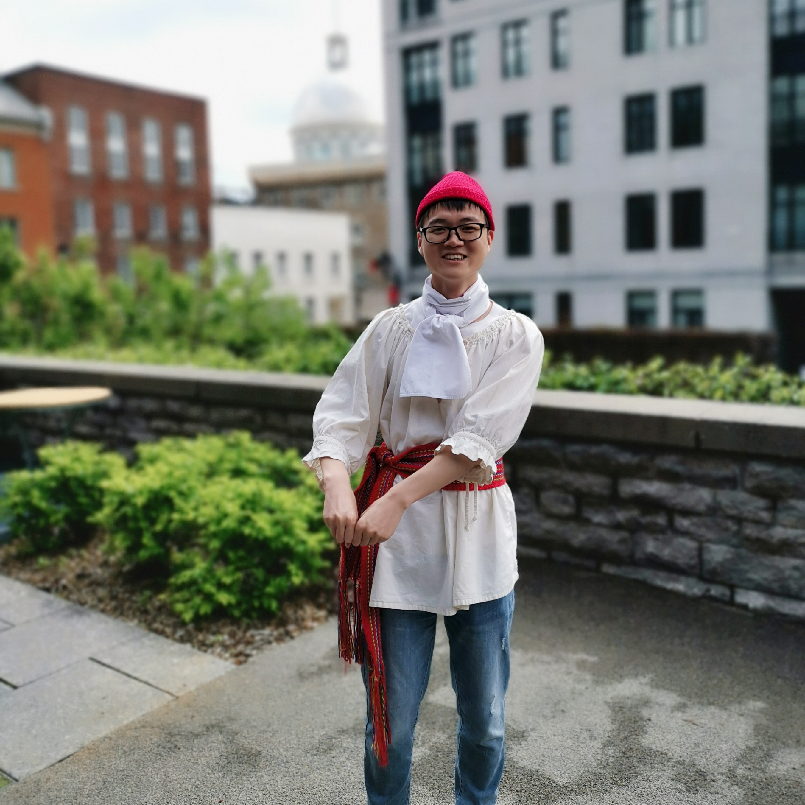

I am a third-year PhD student at [Zhejiang University](https://www.zju.edu.cn/), Hangzhou, China. 

#### Experience

<!-- I was a research fellow with Prof. [Dong Jin Song](https://www.comp.nus.edu.sg/~dongjs/) at [School of Computing](https://www.comp.nus.edu.sg/), [National University of Singapore](http://www.nus.edu.sg/) (2019.04-2020.06). Before that, I was a research fellow with Prof. [Sun Jun](https://sunjun.site/) at [Information Systems Technology and Design](https://istd.sutd.edu.sg/), [Singapore University of Technology and Design](https://www.sutd.edu.sg/) (2018.04-2019.04), where I received my Ph.D. in March 2018. I obtained my B.E. in information engineering from [Xi’an Jiaotong University](http://www.xjtu.edu.cn/) in July 2013. -->

<!--   -->
<!--   -->

#### Research Interest

<!-- In general, my research aims to build more trustworthy systems or software with the help of formal methods or testing techniques. Currently, I am particularly interested in the following research topics:
- Testing, verification and repair of practical deep learning models from multiple dimensions such as robustness, fairness and copyright;
- Verification of concurrent reactive systems, OS kernels;
- (Semi-)Automatic modelling and verification of security protocols;
- Other related topics like fuzzing, symbolic execution, etc. -->

#### Hobbies

<!-- Badminton, football, rock climbing, DOTA2, PES, etc.  -->

#### Contact
[chenjialuo@zju.edu.cn](mailto:chenjialuo@zju.edu.cn)
