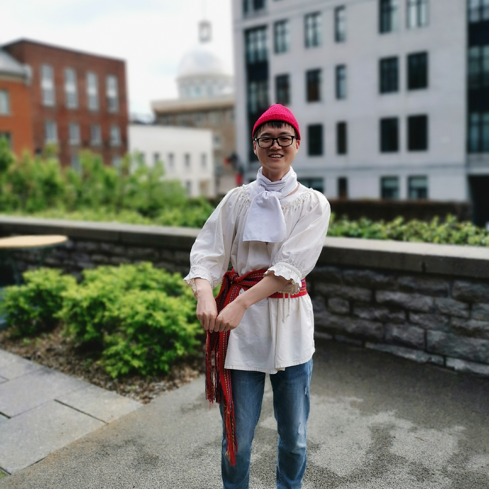

#### Experience

I am currently an Algorithm Expert at **Ant Group** through the Ant Star Program, and a Joint Postdoctoral Researcher at **Zhejiang University**. My research focuses on security for large language models and agent systems. Previously, I worked as a Principal Researcher at **Huawei 2012 Labs**, where I focused on AI infrastructure. I am deeply grateful for that experience.

#### Education

I received my **Ph.D. in Computer Science (Security)** from **Zhejiang University** in 2025, under the supervision of Professors **[Peng Cheng](https://person.zju.edu.cn/en/cp#0)** and **[Jingyi Wang](https://wang-jingyi.github.io/)**. During my doctoral studies, I was a visiting Ph.D. student in Professor **[Youcheng Sun](https://research.manchester.ac.uk/en/persons/youcheng.sun)**’s group at the **University of Manchester** and in Professor **[Marta Kwiatkowska](https://www.cs.ox.ac.uk/people/marta.kwiatkowska/)**’s group at the **University of Oxford**. I received my **B.S. in Automation with honors** from **Chu Kochen Honors College, Zhejiang University**, in 2020.

<!--   -->
<!--   -->

#### Research Interest

- Software Engineering & AI 
- Machine Learning Security
- Agent System Security

#### Contact

I am always open to learning, discussion, and research collaboration. If you are interested in related topics, feel free to reach out by email. I would be very happy to connect and explore potential collaboration.

**[chenjialuo@zju.edu.cn](mailto:chenjialuo@zju.edu.cn)**

**[cjl486639@antgroup.com](mailto:cjl486639@antgroup.com)**

